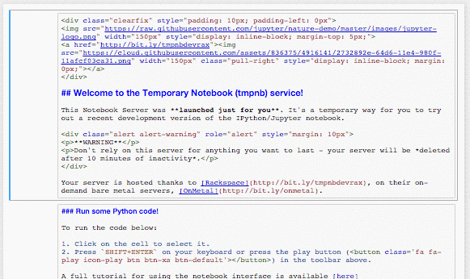
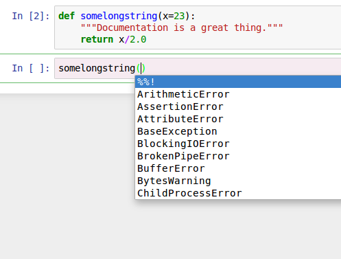
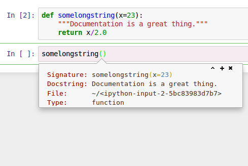

jupyter-vim-binding
===============================================================================
  [](LICENSE) 

Do you use Vim? And you need to use [Jupyter Notebook]?
This is a [Jupyter Notebook][] (formerly known as [IPython Notebook][]) extension to enable Vim like environment powered by [CodeMirror's Vim][].
I'm sure that this plugin helps to improve your QOL.

[Jupyter Notebook]: https://jupyter.org/
[IPython Notebook]: http://ipython.org/notebook.html
[CodeMirror's Vim]: https://codemirror.net/demo/vim.html
[IPython-notebook-extensions]: https://github.com/ipython-contrib/IPython-notebook-extensions

<div align="center">
  
</div>

This extension stands for providing a Vim like environment, so it would drastically overwrite the default mappings and introduce a new behaviors.
For example

- Jupyter has two modes, *Command mode* and *Edit mode* but this extension has three modes, *Jupyter mode*, *Vim command mode*, and *Insert mode*
- Jupyter provides `C` (`Shift-c`) and `V` (`Shift-v`) to perform copy and paste cells but this extension provides `yy` and `p` to perform copy and paste cells
- Jupyter provides `<C-s>` (`Ctrl-s`) to save a checkpoint but this extension eliminate that mapping while `:w` works same
- A lot more.


Need contributors
-------------------------------------------------------------------------------

While I changed my job, I don't use jupyter notebook and I can't make enough time to maintain this plugin.

**So if you like this plugin, please consider to be a contributor.**

https://github.com/lambdalisue/jupyter-vim-binding/issues/89


Installation
-------------------------------------------------------------------------------

There are several ways to install the extension, see [Installation](https://github.com/lambdalisue/jupyter-vim-binding/wiki/Installation) for detail.
The procedure below is a most simple one for quick use (**A recommended way is different from this. See the link above if you are beginner.**)

```bash
# Create required directory in case (optional)
mkdir -p $(jupyter --data-dir)/nbextensions
# Clone the repository
cd $(jupyter --data-dir)/nbextensions
git clone https://github.com/lambdalisue/jupyter-vim-binding vim_binding
# Activate the extension
jupyter nbextension enable vim_binding/vim_binding
```


Usage
-------------------------------------------------------------------------------

This extension provides *Jupyter mode* (For manipulating Jupyter) and *Vim mode* (For manipulating text).
In *Vim mode*, there are *Command mode* and *Insert mode* like native Vim.
Users can distinguish these mode by background color of the cell.

Key mappings are designed for Vimmer so probably you don't need to know much about the mapping but remember the followings to survive:

- All mappings are shown by hitting `<F1>`
- Enter *Vim mode*; a super mode of *Vim command mode* and *Insert mode*; by 1) Double clicking a cell, 2) Hit `<Enter>` on a cell, or 3) Hit `i` on a cell
- Leave *Vim mode* and re-enter *Jupyter mode* by `:q` or `<S-Esc>` (`Shift-Escape`)
- Enter *Insert mode* or leave *Insert mode* as like Vim (`i`, `a`, etc.)

You can find detail information about the mappings or concept in [Concept](https://github.com/lambdalisue/jupyter-vim-binding/wiki/Concept) page.


Completion and Tooltip
-------------------------------------------------------------------------------

jupyter-vim-binding supports `<C-n>`/`<C-p>` completion and `<C-g>` tooltip in a code cell (not in markdown / raw cell).
These mappings are not listed in a help panel, due to a technical limitation.

When user hit `<C-n>` or `<C-p>`, a completion panel like below will be shown.
Once the completion panel is shown, users can select a candidate by `<C-n>`/`<C-p>` and apply by `<Enter>` or cancel by `<Esc>`.



When user hit `<C-g>`, a tooltip panel like below will be shown.
The tooltip will disappear when users perform some actions like hitting a key.



Note that you can repeat `<C-g>` to make the tooltip larger (more informations).


Plug mappings
-------------------------------------------------------------------------------

jupyter-vim-binding provides the following `<Plug>` mappings for CodeMirror.

- `<Plug>(vim-binding-j)` : `j` which move to the next cell at the cell side
- `<Plug>(vim-binding-k)` : `k` which move to the previous cell at the cell side
- `<Plug>(vim-binding-gj)` : `gj` which move to the next cell at the cell side
- `<Plug>(vim-binding-gk)` : `gk` which move to the previous cell at the cell side
- `<Plug>(vim-binding-+)` : `+` which move to the next cell at the cell side
- `<Plug>(vim-binding--)` : `-` which move to the previous cell at the cell side
- `<Plug>(vim-binding-_)` : `_` which move to the next cell at the cell side

While CodeMirror's Vim does not provide `noremap` type of mappings.
You need to use these `<Plug>` mappings to prevent infinity loop (See samples in Customization section).


Customization
-------------------------------------------------------------------------------

To customize key mappings in *Vim mode*, you need to understand that there are two kinds of mappings in this extension:

1. Mappings provided by [Jupyter Notebook][], users can customize this type of mappings with [Keyboard shortcut editor][] provided in [IPython-notebook-extensions][]
2. Mappings provided by [CodeMirror's Vim][], users can customize this type of mappings with [`custom.js`][] as described below

To customize mappings provided by [CodeMirror's Vim][], create a [`custom.js`][] at `~/.jupyter/custom/custom.js` (at least in Linux) and use [CodeMirror's Vim API][] to manipulate like:

```javascript
// Configure CodeMirror Keymap
require([
  'nbextensions/vim_binding/vim_binding',   // depends your installation
], function() {
  // Map jj to <Esc>
  CodeMirror.Vim.map("jj", "<Esc>", "insert");
  // Swap j/k and gj/gk (Note that <Plug> mappings)
  CodeMirror.Vim.map("j", "<Plug>(vim-binding-gj)", "normal");
  CodeMirror.Vim.map("k", "<Plug>(vim-binding-gk)", "normal");
  CodeMirror.Vim.map("gj", "<Plug>(vim-binding-j)", "normal");
  CodeMirror.Vim.map("gk", "<Plug>(vim-binding-k)", "normal");
});

// Configure Jupyter Keymap
require([
  'nbextensions/vim_binding/vim_binding',
  'base/js/namespace',
], function(vim_binding, ns) {
  // Add post callback
  vim_binding.on_ready_callbacks.push(function(){
    var km = ns.keyboard_manager;
    // Allow Ctrl-2 to change the cell mode into Markdown in Vim normal mode
    km.edit_shortcuts.add_shortcut('ctrl-2', 'vim-binding:change-cell-to-markdown', true);
    // Update Help
    km.edit_shortcuts.events.trigger('rebuild.QuickHelp');
  });
});
```

If you would like to customize the design, create a your `custom.css` at `~/.jupyter/custom/custom.css` (at least in Linux) like:

```css
/* Jupyter cell is in normal mode when code mirror */
.edit_mode .cell.selected .CodeMirror-focused.cm-fat-cursor {
  background-color: #F5F6EB !important;
}
/* Jupyter cell is in insert mode when code mirror */
.edit_mode .cell.selected .CodeMirror-focused:not(.cm-fat-cursor) {
  background-color: #F6EBF1 !important;
}
```

See [Customization](https://github.com/lambdalisue/jupyter-vim-binding/wiki/Customization) to find useful snippets. Don't be afraid to share your snippets at that page ;-)

[Keyboard shortcut editor]: https://github.com/ipython-contrib/IPython-notebook-extensions/tree/master/nbextensions/usability/keyboard_shortcut_editor
[`custom.js`]: http://jdfreder-notebook.readthedocs.org/en/docs/examples/Notebook/JavaScript%20Notebook%20Extensions.html
[CodeMirror's Vim API]: https://codemirror.net/doc/manual.html#vimapi


Limitation
-------------------------------------------------------------------------------

jupyter-vim-binding has following technical limitation.
If anybody know about a confirmed workaround for these limitations, let me know.

### Google Chrome

Google Chrome prohibits javascript to override several key mappings such as `Ctrl-N`, `Ctrl-T`, etc.
Because of this policy, users have no chance to use default key mappings of jupyter-vim-binding such as `<C-n>` completion.

- https://code.google.com/p/chromium/issues/detail?id=33056
- http://stackoverflow.com/questions/15911785/overriding-shortcut-keys-in-firefox-and-chrome
- https://github.com/liftoff/GateOne/issues/290

### Vivaldi

The chromium-based [Vivaldi][vivaldi] browser provides more flexibility in key mapping customizations and might be a viable alternative to Google Chrome for power users.
In contrast to Google Chrome or Chromium, (almost) all keyboard shortcuts in Vivaldi can be [changed or disabled][vivaldi-keyboard], including (but not limited to) `Ctrl-N`, `Ctrl-T`, `Ctrl-J`, etc.

Furthermore, Vivaldi allows assigning a keyboard shortcut to temporarily [disable all other browser keyboard shortcuts][vivaldi-disable], making all key mappings available for other uses.
Note that this temporary change applies globally to *all* tabs and windows of the browser instance (or "Profile") under consideration. To confine it to a subset of tabs, use a separate profile via [the `--user-data-dir=...` option][user-data-dir].

[vivaldi]: https://vivaldi.com/
[vivaldi-keyboard]: https://vivalditips.com/customization/shortcuts/en
[vivaldi-disable]: https://www.ghacks.net/2017/02/07/vivaldi-tip-block-all-keyboard-shortcuts/
[user-data-dir]: https://chromium.googlesource.com/chromium/src/+/master/docs/user_data_dir.md

### Clipboard

Most of modern browsers prohibit javascript to access a system clipboard without user action such as clicking a button.
Because of this, there is no chance to enable copy and paste through `yy`, `dd`, or `p` while HTML5 clipboard object cannot be retrieved in a `keydown` event or so on.
So Users need to use browser default mappings such as `Ctrl-C`, `Ctrl-V` if they want to copy and paste through a system clipboard.

The followings are clipboard library for javascript but all of them require `click` event or no paste support.

- https://github.com/zeroclipboard/zeroclipboard
- https://clipboardjs.com/

What we need is a `clipboard` object which can used for copy and paste in a `keydown` event rather than `click` event.
However, I don't know any workaround for this so it is impossible to perform copy and paste in `yy` or `p` for now.


License
-------------------------------------------------------------------------------

The MIT License (MIT)

Copyright (c) 2015-2016 Alisue, hashnote.net

Permission is hereby granted, free of charge, to any person obtaining a copy
of this software and associated documentation files (the "Software"), to deal
in the Software without restriction, including without limitation the rights
to use, copy, modify, merge, publish, distribute, sublicense, and/or sell
copies of the Software, and to permit persons to whom the Software is
furnished to do so, subject to the following conditions:

The above copyright notice and this permission notice shall be included in
all copies or substantial portions of the Software.

THE SOFTWARE IS PROVIDED "AS IS", WITHOUT WARRANTY OF ANY KIND, EXPRESS OR
IMPLIED, INCLUDING BUT NOT LIMITED TO THE WARRANTIES OF MERCHANTABILITY,
FITNESS FOR A PARTICULAR PURPOSE AND NONINFRINGEMENT. IN NO EVENT SHALL THE
AUTHORS OR COPYRIGHT HOLDERS BE LIABLE FOR ANY CLAIM, DAMAGES OR OTHER
LIABILITY, WHETHER IN AN ACTION OF CONTRACT, TORT OR OTHERWISE, ARISING FROM,
OUT OF OR IN CONNECTION WITH THE SOFTWARE OR THE USE OR OTHER DEALINGS IN
THE SOFTWARE.
